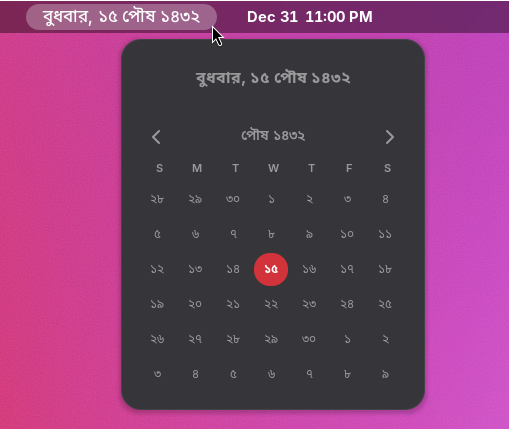

# Bongabdo (GNOME Shell)



Show today’s **Bengali date** in the GNOME top bar, with an optional **month view** in the popup.

- GNOME Shell: **45–49**
- Location: **West Bengal/India** (Surya Siddhanta mapping) or **Bangladesh** (fixed calendar)

### Requirements
You need:
- **GNOME Shell**
- The **Extensions** app / `gnome-extensions` command
- A **Bengali font** (recommended: **Noto Sans Bengali**)

### Install Bengali fonts (recommended)
Pick your distro:

- **Ubuntu / Debian**:

```bash
sudo apt update
sudo apt install -y fonts-noto-core
```

- **Fedora**:

```bash
sudo dnf install -y google-noto-sans-bengali-fonts
```

- **Arch / Manjaro**:

```bash
sudo pacman -S --needed noto-fonts
```

### Install the extension (from this repo)
1) Install required tools:

- **Ubuntu / Debian**:

```bash
sudo apt update
sudo apt install -y git make gnome-shell-extension-prefs
```

- **Fedora**:

```bash
sudo dnf install -y git make gnome-extensions-app
```

- **Arch / Manjaro**:

```bash
sudo pacman -S --needed git make gnome-shell
```

2) Install:

```bash
git clone https://github.com/ByteHackr/Bongabdo.git
cd Bongabdo
make install
```

3) Enable:

```bash
gnome-extensions enable bongabdo@bongabdo.github.io
```

4) Restart GNOME Shell:
- **Xorg**: press `Alt+F2`, type `r`, press Enter
- **Wayland**: log out and log back in

### Use / Settings
- Open **Extensions** → **Bongabdo** → **Settings**, or right‑click the panel date → **Preferences**
- Useful options:
  - Location (West Bengal/India vs Bangladesh)
  - Panel position (left / center / right)
  - Font size
  - Show month calendar in popup

### Notes (West Bengal/India accuracy)
For **West Bengal/India**, Bongabdo uses `lib/bengaliMonthStarts.json` (Surya Siddhanta / Panjika month-start dates).
If a year is missing from the file, it falls back to a simple heuristic (Apr 14 ≈ Pohela Boishakh).

### Troubleshooting
- If you don’t see the indicator, run:

```bash
gnome-extensions list | grep bongabdo
```

- To view logs:

```bash
journalctl --user -f | grep -i bongabdo
```

### Development (optional)
- Run tests:

```bash
./test/run-tests.sh
```

### License
MIT
